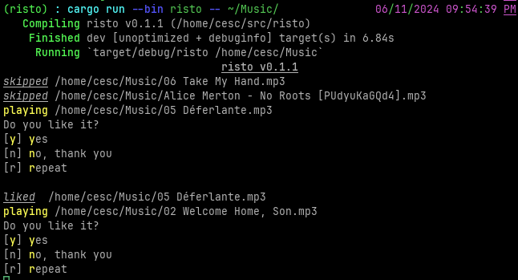

# Risto

Cleaning up your music but don't want to open every single file indivudually
opening those files in most players is also not an option because you can't directly
delete them while listening.

Risto is a poor man's music rater, it will keep playing songs and asking if you
would like to keep  until them until exhausted, unliked files are moved to trash 

Set env-var `ACOUSTID_API_KEY` [acoustid.org](https://acoustid.org) to retrieve
music metadata.
